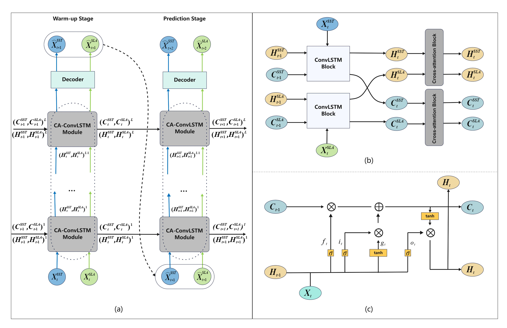

# A Cross-Attention-Based Deep Learning Framework for Joint Prediction of Sea Surface Temperature and Sea Level Anomaly

# code for CA-ConvLSTM
# **ABSTRACT**
Accurate prediction of sea surface temperature (SST) and sea level anomaly (SLA) is essential
for numerical weather prediction, climate monitoring, and ocean state estimating, as both
variables are key indicators of the thermal and dynamic conditions of the upper ocean.
However, effectively capturing the complex dynamic coupling between SST and SLA,
along with their spatiotemporal dependencies and mutual influences, remains a
significant challenge. This study proposes a unified deep learning framework, termed CA-ConvLSTM,
which jointly predicts SST and SLA by integrating a cross-attention mechanism with a Convolutional
Long Short-Term Memory (ConvLSTM) architecture. The cross-attention module enables dynamic feature
interaction between SST and SLA, allowing to effectively capture complex spatiotemporal
dependencies. A key advantage of CA-ConvLSTM lies in its ability to simultaneously learn from
SST and SLA through a unified training process, thus improving the prediction
accuracy of both variables. Numerical experiments conducted in the South China Sea demonstrate
that CA-ConvLSTM consistently outperforms several state-of-the-art baselines, such as ConvLSTM,
PredRNN, TCTN, and SwinLSTM, which are trained separately on SST or SLA data. These findings
highlight the potential for incorporating multivariate oceanic parameters through
attention-based mechanisms to advance marine prediction capabilities.